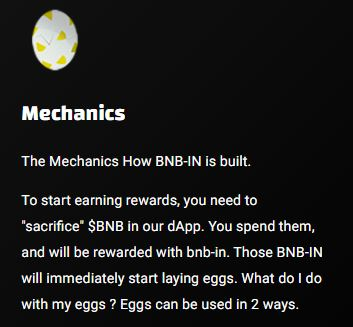

# 🌟 Mechanics

## The Mechanics How BNB-IN is built

To start earning rewards, you need to "sacrifice" **$BNB** in our dApp. You spend them, and will be rewarded with bnb-in. Those BNB-IN will immediately start laying eggs.&#x20;

**What do I do with my eggs ? Eggs can be used in 2 ways:**&#x20;

* [x] The first way is to hatch them to get even more chicken (Compound).&#x20;
* [x] The second way is to sell them in exchange for $BNB tokens (Claim).&#x20;

**Anti whale The contract has a built-in anti whale feature that is necessary in order to secure more sustainability.**&#x20;

See below:&#x20;

* User 1 compounds 6 days and claims the 7th day: this user gets the highest daily percentage in that 24 hour period.&#x20;
* User 2 compounds 5 days and claims 2 days: this user gets a lower percentage.&#x20;
* User 3 compounds 4 days and claims 3 days: this user gets an even lower percentage. This happens all the way down to a net 0.5% reward (for a 24 hour period) for the user that keeps claiming (Sell Eggs). This is necessary to prevent users from draining the TVL, and thus creating the sustainability we need to get the project going forward.&#x20;

**Compounding strategy Our advice:**&#x20;

Hatch eggs for 6 days and sell eggs 1 day a week. It will compound your investment and you will receive your initial back in 6-8 weeks.

<figure><figcaption></figcaption></figure>
