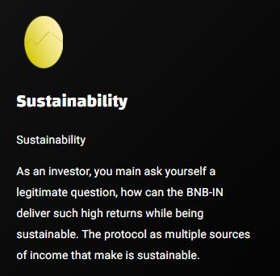

# 🌟 Sustainability

## Sustainability

As an investor, you main ask yourself a legitimate question, how can the BNB-IN deliver such high returns while being sustainable. The protocol as multiple sources of income that make is sustainable.&#x20;

BNB-IN is the FIRST miner that is sustainable for a very long time due to it's unique approach including a token **$BNBIN** that gets burned to feed incubator. This concept limits runnaway miner inflation that will inevitably lead to other miner protocols failing, leaving lots of investors sitting on worthless miners.

**BNB-IN implements even more features that make sure investments are safe. These features include:**

* 10% trading fee on the $BNB-IN token from which **7%** feed the pool making it grow and act as buffer.
* Auto-Strategies: Make sure invesors don't accumulate large anount of eggs they could panicsell. In fact no account can sccumulate eggs for more than 2 days.
* Smart-Slippage: Makes sure whales can't drain the pool at once protecting investments. Smart-Slippage is designed to auto-Increase during times of low demand, making sure the pool can't be drained quickly.

<figure><figcaption></figcaption></figure>
